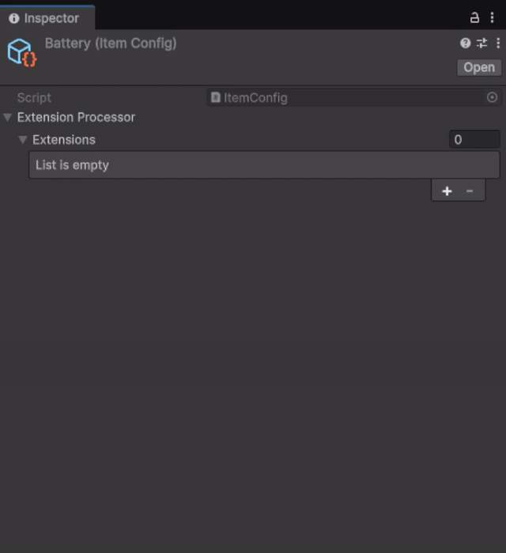

# Configurators

**English** | [Русский](README.ru.md)

---

A serializable, pooled, DI-aware system for **modifications** (one-shot effects applied to a context) and **conditions** (boolean predicates with change notifications). Both are built from polymorphic `[SerializeReference]` lists you fill in the inspector.

## Installation

Pick one of the two options.

**1. `.unitypackage` (recommended).** Grab the latest `Configurators.unitypackage` from the [Releases](../../releases) page, then either double-click the file with Unity open or use `Assets → Import Package → Custom Package...` from the menu. Unity will show a checklist of files to import — leave everything ticked and confirm.

**2. Manual copy.** Download the repository (Code → Download ZIP, or `git clone`) and drop the `Configurators` folder anywhere under your project's `Assets/`.

Either way, everything compiles into the default `Assembly-CSharp` — no assembly definitions, no manifests.

**Requirements:** Unity 6000.0 or newer, [Zenject / Extenject](https://github.com/Mathijs-Bakker/Extenject) present in the project.

## Concepts

| Term | Meaning |
|---|---|
| **Modification** | A unit of work applied to some `TContext`. Example: "set max HP", "add tag", "spawn child". |
| **Condition** | A boolean predicate that can be queried (`IsMet`) and listened to (`AddListener`). |
| **Extension** | A passive value carrier attached to a config (e.g. `MaxCount`, `Cooldown`). Read by feature code via `ExtensionProcessor.TryGetExtension<T>`. |
| **Processor** | Container that holds a list of modifications / conditions / extensions. Lives on a config or component. |
| **Handler** | DI-resolved, pooled runtime logic for a data object. Optional — only needed when you want injected services or pooling. |
| **ConfiguratorManager** | Project-scoped service that resolves handlers, manages their lifetime, and wires conditions to listeners. |

## Defining a modification

You have two options.[^actor-unit]

### Inline (no DI, no pooling)

For simple modifications without external dependencies. Just put the logic on the data class.

```csharp
[Serializable]
[ConfiguratorCategory("Stats")]
public class SetMaxHealth : Modification<ActorUnit>
{
    public int Value;

    public override void Apply(ActorUnit context)
    {
        context.GetAbility<HealthAbility>().SetMax(Value);
    }
}
```

### Handler-based (DI + pooling)

For modifications that need injected services or stateful logic. Data and behaviour live in separate classes.

```csharp
// data — sits in the config, pure POCO
[Serializable]
[ConfiguratorCategory("Spawn")]
public class SpawnChild : ModificationData<ActorUnit, SpawnChildHandler>
{
    public ActorUnit Prefab;
    public Vector2 Offset;
}

// handler — created by Zenject, returned to a pool on dispose
public class SpawnChildHandler : ModificationHandler<SpawnChild, ActorUnit>
{
    [Inject] private readonly IObjectCreator _creator;
    
    public override void Apply(ActorUnit context)
    {
        _creator.Instantiate(Data.Prefab, (Vector2)context.transform.position + Data.Offset, null);
    }
}
```

## Defining a condition

Same two flavours.

### Inline

```csharp
[Serializable]
[ConfiguratorCategory("Time")]
public class IsNight : Condition
{
    public override bool IsMet() => DayCycle.Current == TimeOfDay.Night;
    // call NotifyChanged() whenever the underlying state flips
}
```

### Handler-based

```csharp
[Serializable]
public class HealthBelow : ConditionData<HealthBelowHandler>
{
    [Range(0, 1)] public float Threshold;
}

public class HealthBelowHandler : ConditionHandler<HealthBelow>
{
    [Inject] private readonly IHealthService _health;

    public override bool IsMet() => _health.Ratio < Data.Threshold;

    protected override void OnFirstListenerAdded() => _health.OnChanged += NotifyChanged;
    protected override void OnLastListenerRemoved() => _health.OnChanged -= NotifyChanged;
}
```

## Composite conditions

Combine conditions with `All`, `Any`, `None`, `Not` — they're regular conditions, so they nest freely:

```
All
├── HealthBelow (0.5)
├── IsNight
└── Not
    └── HasItem (key)
```

Listeners on a composite fire **once per inner change**, regardless of how many external listeners are attached.

## Extensions

Pure data attached to a config and read on demand. No handler, no resolve.

```csharp
[Serializable]
[ConfiguratorCategory("Limits")]
public class MaxCount : Extension<int>
{
    [SerializeField] private int _value;
    
    public override int Value => _value;
}

// usage — implicit conversion to T is supported
int max = item.ExtensionProcessor.TryGetExtension(out MaxCount ext) ? ext : int.MaxValue;
```

For multiple extensions of the same type use `GetExtensions<T>()` instead.

## Runtime usage

Inject `IConfiguratorManager` and call one of four methods.

### Apply modifications to a context

```csharp
[Inject] private readonly IConfiguratorManager _configurators;

// With a Component lifetime owner — auto-disposed when the owner GameObject is destroyed.
private void Spawn(ActorUnit actor)
{
    _configurators.ApplyModifications(actor.Modifications, actor, lifetimeOwner: actor);
}

// Without an owner — caller manages disposal. Useful in non-MonoBehaviour services.
public class SomeService : IDisposable
{
    [Inject] private readonly IConfiguratorManager _configurators;
    
    private IDisposable _binding;

    public void Setup(ModificationProcessor<SomeContext> processor, SomeContext context)
    {
        _binding = _configurators.ApplyModifications(processor, context);
    }

    public void Dispose() => _binding?.Dispose();
}
```

### Subscribe to a condition processor

```csharp
private IDisposable _sub;

private void OnEnable()
{
    _sub = _configurators.SubscribeConditions(
        config.Conditions,
        isMet => gameObject.SetActive(isMet),
        lifetimeOwner: this);
}

// _sub.Dispose() to unsubscribe early; otherwise auto-disposed when `this` is destroyed.
```

### Resolve only (low-level)

When you want to control when modifications are applied independently of when handlers are bound:

```csharp
IDisposable binding = _configurators.ResolveModifications(processor);
processor.Apply(context);   // can be called multiple times
processor.Apply(otherContext);
// ... later ...
binding.Dispose();
```

## Inspector

The built-in processors (`ModificationProcessor<T>`, `ConditionProcessor`, `ExtensionProcessor`) already expose a typed dropdown — drop one on a config / component and it just works, no list declaration on your side.

To group your own modifications / conditions / extensions under a submenu in that dropdown, decorate the class with `[ConfiguratorCategory("Path/Submenu")]`:

```csharp
[Serializable]
[ConfiguratorCategory("Inventory/Item")]
public class MaxCount : Extension<int> { ... }
```

<p align="center">
  
</p>

If you ever need a polymorphic list outside the built-in processors, decorate it yourself with `[SerializeReference, ConfiguratorSelector]` — that's the same attribute the processors use internally.

## Lifetime contract

* `ApplyModifications` / `SubscribeConditions` always return an `IDisposable`. With a `lifetimeOwner` cleanup is automatic on owner destruction; without one, the caller owns disposal.
* Calling the same method twice on the same processor without disposing the first binding is a bug and produces a warning + no-op.
* Calling `Dispose()` on the returned `IDisposable` is idempotent and safe in any order — exceptions in cleanup are logged, not thrown.

## License

Released under the [MIT License](LICENSE.md). Free to use in personal and commercial projects.

Authored by **Egor Shesterikov**.

[^actor-unit]: `ActorUnit` shown throughout the examples is a project-specific class outside this module — substitute it with whatever type you want to apply modifications or check conditions against. Modifications and conditions are agnostic about what `TContext` is.
